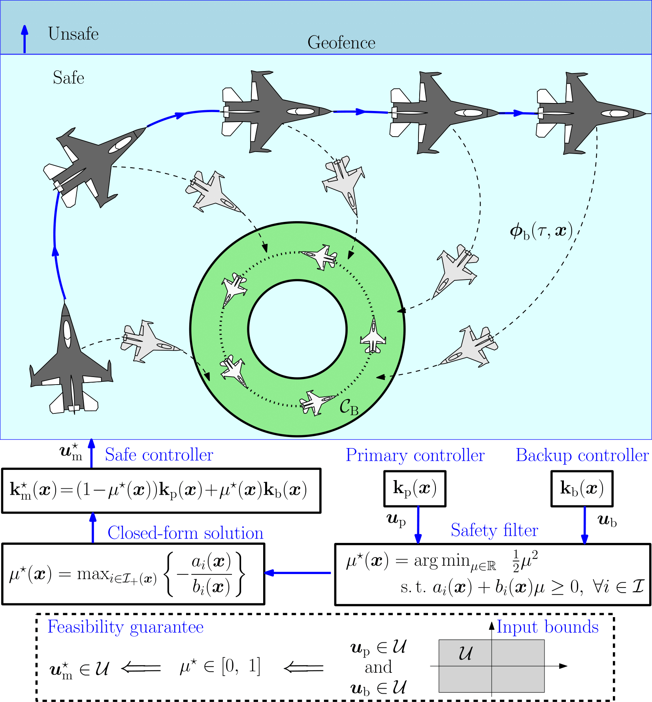

# Safety-Critical Control with Bounded Inputs: A Closed-Form Solution for Backup Control Barrier Functions

<p align="center">
  <br>
  <em>Overview of the proposed safety-critical control synthesis framework, illustrated on a fixed-wing aircraft geofencing scenario. Our <b>optimally interpolated (OI)</b> controller guarantees the safety of nonlinear affine systems with input bounds and is obtained in closed-form.</em>
</p>

*Abstract*: 
Verifying the safety of controllers is critical for many applications, but is especially challenging for systems with bounded inputs. Backup control barrier functions (bCBFs) offer a structured approach to synthesizing safe controllers that are guaranteed to satisfy input bounds by leveraging the knowledge of a backup controller. While powerful, bCBFs require solving a high-dimensional quadratic program at run-time, which may be too costly for computationally-constrained systems such as aerospace vehicles. We propose an approach that optimally interpolates between a nominal controller and the backup controller, and we derive the solution to this optimization problem in closed form. We prove that this closed-form controller is guaranteed to be safe while obeying input bounds. We demonstrate the effectiveness of the approach on a double integrator and a nonlinear fixed-wing aircraft example.

David E. J. van Wijk, Ersin Das, Tamas G. Molnar, Aaron D. Ames, Joel W. Burdick, "Safety-Critical Control with Bounded Inputs: A Closed-Form Solution for Backup Control Barrier Functions
", Submitted to American Control Conference (ACC), 2026. Preprint: [[link]](https://arxiv.org/abs/2510.05436#)

## BibTeX Citation

```
@article{vanwijk2025safetycriticalcontrolboundedinputs,
  title={Safety-Critical Control with Bounded Inputs: A Closed-Form Solution for Backup Control Barrier Functions},
  author={van Wijk, David E J and Da{\c{s}}, Ersin and Molnar, Tamas G and Ames, Aaron D and Burdick, Joel W},
  journal={arXiv preprint arXiv:2510.05436},
  year={2025}
}
```
